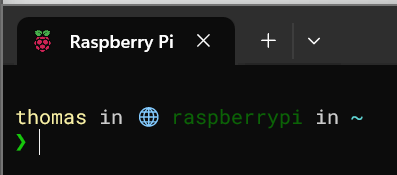
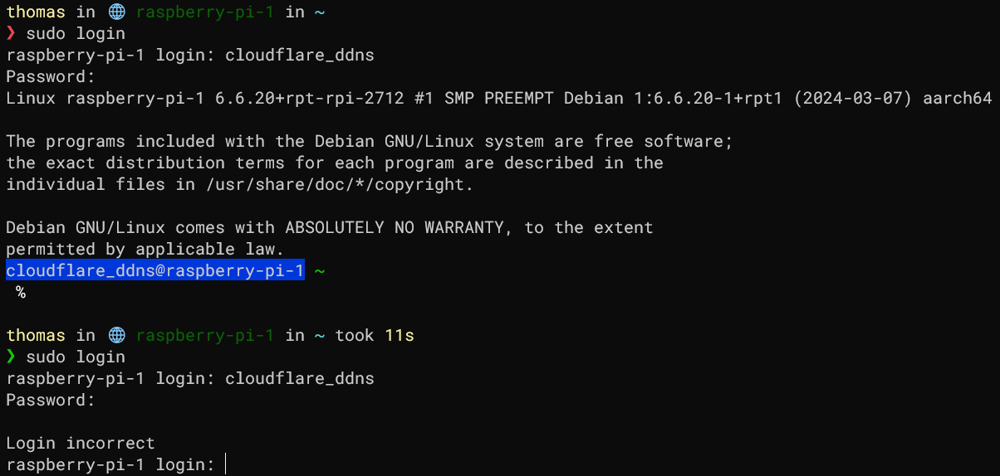

# Raspberry Pi IaC
Contains the Infrastructure as Code files which are used for provisioning my in house Raspberry Pi.

- [Raspberry Pi IaC](#raspberry-pi-iac)
  - [Prerequisites](#prerequisites)
    - [Ansible control node prerequisites](#ansible-control-node-prerequisites)
    - [Environment prerequisites](#environment-prerequisites)
    - [Raspberry Pi preparation](#raspberry-pi-preparation)
  - [Provisioning](#provisioning)
  - [Overview of installed software](#overview-of-installed-software)
    - [SSH with ZSH](#ssh-with-zsh)
  - [Other](#other)
    - [Reinstalling the Pi](#reinstalling-the-pi)
    - [The external Kingston drive](#the-external-kingston-drive)
    - [Debugging users other than the main user](#debugging-users-other-than-the-main-user)
    - [Manually restoring a backup](#manually-restoring-a-backup)
      - [Restoring the database content](#restoring-the-database-content)
      - [Restoring docker backups](#restoring-docker-backups)

## Prerequisites
The files within this repository should be run on a computer with Ansible installed which is only supported on MacOS and Linux systems. For Windows it can be run within a WSL distro (see [this guide](https://code.visualstudio.com/docs/remote/wsl-tutorial) on how to set this up, make sure the repository is checked out on the WSL distribution itself).

### Ansible control node prerequisites
1. Install Ansible ([see instructions](https://docs.ansible.com/ansible/latest/installation_guide/intro_installation.html)).
2. Install Ansible Galaxy content:

    ```bash
    ansible-galaxy install -r requirements.yml
    ```
3. Install the Python3 passlib library (used internally in the user role);

    ```bash
    sudo apt install python3-passlib
    ```
4. Enter the vault password in the **.vault_pass** file. This is included in **.gitignore** so it shouldn't end up in the repository:

    ```bash
    # Notice the space at the beginning, this prevents the shell from saving this command in its history.
     echo '[ -- enter vault pass here -- ]' > .vault_pass
    ```

### Environment prerequisites
The Raspberry Pi IaC code contained within this repository provisions the Raspberry Pi itself but doesn't provision all surrounding infrastructure which is presumed to be managed by hand. The following relevant configuration is assumed:

1. [A prepared Raspberry Pi]((#raspberry-pi-preperation)).
3. [Cloudflare](https://dash.cloudflare.com/login) should be setup for managing the domain records of *kleinendorst.info*.

### Raspberry Pi preparation
The Raspberry Pi should be installed and running with reachable SSH from the network.

1. Setup its MicroSD card using the Raspberry Pi Imager ([download](https://www.raspberrypi.com/software/)). For **CHOOSE OS** select the : **Raspberry Pi OS (other)** > **Raspberry Pi OS Lite (64-bit)** option.
2. When asked: **Would you like to apply OS customization settings?** select **EDIT SETTINGS**. Select and fill in the following settings:
    1. **Set username and password**
    2. **Set locale settings**
    3. **Enable SSH** > **Allow public-key authentication only** and enter your computer's public key.
    4. Disable **Eject media when finished** (probably not really important but I heard it could prevent problems on Windows).
3. Start the Raspberry Pi with an ethernet cable attached.
4. Find the assigned IP of the Raspberry Pi in the [router](http://asusrouter.com/) and configure DHCP to statically assign this address to the Raspberry Pi.
5. Add the new Raspberry Pi to the *hosts* file using the internal IP if it isn't there already.
6. Test if the Raspberry Pi is correctly configured by opening an SSH session to it (using its IP address).

## Provisioning
Provision the Raspberry Pi by running:

```bash
ansible-playbook playbook.yml
```

## Overview of installed software
### SSH with ZSH
It's possible to connect to the Raspberry Pi from the internal network via either its FQDN or IP address **using a public key only** setup as part of [the Raspberry Pi preparation](#raspberry-pi-preparation).
When logged in the user will be prompted with the **zsh** configured with **[Oh My Zsh](https://ohmyz.sh)** and **[Starhip](https://starship.rs) prompts**.



## Other
### Reinstalling the Pi
It can be handy to reinstall the Pi. First shutdown the pi by running `sudo shutdown` from SSH. Next take out the memory card and follow all steps in [Raspberry Pi preparation](#raspberry-pi-preparation).
For the next step remove the current *known_hosts* entry with: `ssh-keygen -R '192.168.50.27'` for all PCs that had SSH access to the Pi.

### The external Kingston drive
An external 1 TiB drive is installed. The drive isn't directly managed by Ansible although some files/folders might be written to from it.
Use [this guide](https://raspberrytips.com/format-mount-usb-drive/) for setting up the proper filesystem.
Notice that mounting the volume automatically via **/etc/fstab** is done automatically by Ansible.

### Debugging users other than the main user
The **user** role included in this repository makes it possible to create new users which will also have a fully configured
ZSH environment. They can't be accessed via SSH because no SSH keys are added for them and password logins are disabled.
Logging into the new user's account can be done as follows (for testing and debugging):

```bash
# Enter both the username and password
sudo login
```

This is verified to be working:



### Manually restoring a backup
The `backups` role will install scripting which automatically backs up specific files and uploads it to an external service called
[BorgBase](https://www.borgbase.com). This section describes manually restoring such a backup after cleanly reinstalling the Pi from scratch.

First what's needed is a reference to the Borg repo URL and passphrase. They can be found in the vault file located at: `roles/backups/vars/main/vault.yml`.
Read out the values using the `ansible-vault` binary. Log into the Raspberry Pi, change to root and fill the `BORG_REPO` and `BORG_PASSPHRASE` variables:

```bash
sudo -i
export BORG_REPO='...'
export BORG_PASSPHRASE='...'
```

The `backups` role generates a new SSH key pair when run. Since we're assuming in this section a new install took place we'll have to upload the newly
generated public key into BorgBase. The correct key is stored in the `root` user's home folder, view it with `cat ~/.ssh/id_ssh_rsa.pub` and upload it
to [BorgBase](https://www.borgbase.com). Make sure to also remove any old keys and add it to the repository with "full access".

It should now be possible to view backups contained within the borg repo by running: `borg list`. Now run the following commands (replacing `[ARCHIVE_NAME]`):

```bash
mkdir /bulk/backup_work_dir
cd /bulk/backup_work_dir/

borg extract '::[ARCHIVE_NAME]'
```

The files are now unpacked in this directory, make sure to clean up this directory after use.

#### Restoring the database content
In order to restore the database backups: first log into the PostgreSQL database's REPL shell with the credentials
of the `postgres` user found in the role's vault (if required). Now run the following commands (substituting `[DBNAME]`):

First:

```bash
docker exec -ti postgres-postgres-1 psql --user postgres
```

Then:

```sql
CREATE DATABASE [DBNAME];
CREATE USER [DBNAME] WITH PASSWORD '...';
GRANT ALL PRIVILEGES ON DATABASE [DBNAME] TO [DBNAME] WITH GRANT OPTION;
ALTER DATABASE [DBNAME] OWNER TO [DBNAME];
```

Now that the user exists, exit from the `psql` REPL shell and perform the following actions:

```bash
# Copy a database backup into the container
docker cp ./postgres/[DBNAME].sql postgres-postgres-1:/dump.sql

# Load the data into the database
docker exec -ti postgres-postgres-1 psql --username '[DBNAME]' --dbname '[DBNAME]' --file '/dump.sql'

# Remove the dump file from the container
docker exec postgres-postgres-1 rm /dump.sql
```

#### Restoring docker backups
The backups service stores a configuration file at: `/etc/borg_backup_script/backup_configuration.yaml` which
contains an overview of backups. We can use it with a script to loop over the available backups and restore them
(in a similar way to how the backup script itself creates the backups). This script assumes that we want to restore
all backups, change where necessary.

Copy this script to the local folder (still assuming this is the folder which contains the `docker_volumes` and `postgres` directories):

> **Note**: This assumes that the containers are already running. They will be stopped by the script. The script also assumes that
> these directories already exist.

```bash
#!/bin/bash
# Copied and altered from backup_script.sh:
configurationFileLocation='/etc/borg_backup_script/backup_configuration.yaml'
nrOfConfigurations="$(yq '.docker_mount_backups | length' <"$configurationFileLocation")"

for ((i = 0 ; i < "$nrOfConfigurations" ; i++)); do
    dockerConfiguration="$(yq ".docker_mount_backups[$i]" <"$configurationFileLocation")"
    containerName="$(echo "$dockerConfiguration" | jq -r '.container_name')"
    volumeName="$(echo "$dockerConfiguration" | jq -r '.mount_path')"

    specificVolumeBackupPath="./docker_volumes/$volumeName"

    echo "Backup up Docker volume: $volumeName from running container: $containerName..."

    echo "Stopping container: $containerName..."
    docker stop "$containerName"

    echo "Starting new container which copies over files..."
    start=$SECONDS
    docker run --rm -v "$specificVolumeBackupPath:/source" -v "$volumeName:/target" --entrypoint "ash" \
        alpine -c "rm -rf /target/*; cp -rf /source/* /target/"

    elapsedSeconds=$(( SECONDS - start ))
    echo "Copying succeeded (in $elapsedSeconds seconds), restarting container..."
    docker start "$containerName"
done
```
